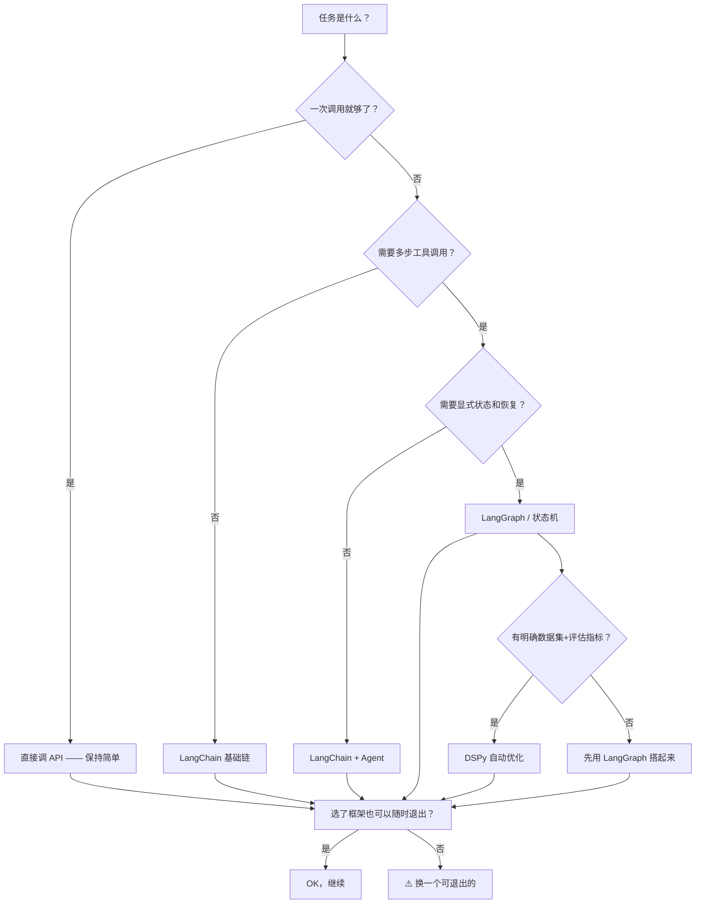

# Daily Note: 2026-05-24 (Sunday)

> Week 1｜共学营：AI 与 Web3 基础知识
> 上一课 (5/23): **智能体（Agent）** — 从回答问题到自主执行
> 今日专题: **框架（Frameworks）** — 从调 API 到搭建系统

---

## 今日课程 / Today's Curriculum

📖 **Handbook 章节**: [框架（Frameworks）](https://aiweb3.school/zh/handbook/ai/frameworks/) (约 7 分钟阅读，2013 字)

关联章节: [智能体（Agent）](https://aiweb3.school/zh/handbook/ai/agent/) — 框架是 Agent 的工程底座，先回顾昨天的 Agent 知识再进入框架

### 核心知识节点

**1. LangChain**
- 最常见的 LLM 应用开发框架，覆盖模型接入、prompt、工具调用、retriever、agent、output parser
- 适合快速把模型能力和外部系统接起来，也适合学习 AI 应用的常见组件
- ⚠️ 小心「抽象太早」：如果没搞清楚自己的工作流就套一堆 chain 和 agent，排查会变难
- 更像一套组件库，不适合替你决定产品边界

**2. LangGraph**
- 偏向工作流和状态机：节点负责执行动作，边负责控制流，state 负责记录过程
- 当任务只是「问一次答一次」时可能太重
- 但当任务需要多轮工具调用、重试、人工确认、分支、恢复和长期运行时，显式 graph 更可靠
- ⚠️ 实用判断：只要你开始关心任务走到哪一步、能否恢复、失败后从哪里继续，就应该考虑 graph

**3. OpenAI Agents SDK**
- 构建带工具、handoff、guardrails、tracing 的 Agent 应用
- 价值在于把 Agent 工作流里的常见工程问题做成可组合结构
- ⚠️ 关键仍然是边界：SDK 可以帮你执行流程，但你要定义哪些工具可用、哪些动作需要确认、什么输出算失败

**4. DSPy**
- 把 prompt / LM pipeline 写成可优化的程序
- 不是手工调提示词，而是定义输入输出、模块和指标，用 optimizer 改进 prompt 或调用策略
- 当任务只是写一段文案，DSPy 未必必要；当有明确数据集、评估指标和可重复任务时更有价值
- ⚠️ 关键启发：不要只靠感觉调 prompt，要让任务、数据和指标进入系统

**5. Hermes（作为模型/Agent 生态）**
- 更适合作「面向工具调用和结构化输出的模型/Agent 生态」来理解
- 模型本身是否擅长 tool calling、JSON mode、long context、reasoning 也会影响系统设计
- ⚠️ 看 Hermes 这类方向时，不要只看榜单分数，要看是否能稳定产生你需要的结构化输出和工具调用格式

**6. Learning Agent（从反馈中改进）**
- 指系统从反馈、日志、评估结果或用户修正中改进
- 「学习」不一定是训练模型，也可以是更新 prompt、调整 retriever、补充规则、改进测试集
- ⚠️ 最容易踩的坑：把线上反馈直接变成行为变化 → 数据污染、越权学习、不可解释变化
- 更稳流程：记录失败样本 → 人工标注原因 → 加入 eval set → 修改配置 → 通过测试后再上线

### 第一性原理 / First Principles

> 框架是系统边界的表达，不是智能本身。先理解工作流，再决定用不用框架。

- ✅ 简单链路先保持简单：一次模型调用、一次检索、一次格式化输出，不一定需要复杂框架
- ✅ 长流程需要显式状态：多步任务、工具调用、人工确认、失败恢复，应该有可查询的 state
- ✅ 框架要能退出：如果某个框架让你很难换模型、换向量库、换部署方式，长期成本会很高
- ⚠️ 很多失败的 AI 项目不是输在没有框架，而是先引入框架，再让产品逻辑迁就框架

### 在 AI x Web3 中的位置

> Frameworks 不该替代 Web3 侧的权限、签名、交易模拟和账户规则。框架可以组织 Agent，不能替用户承担资产风险。

**BD/产品视角的关键思考：**
- 框架选择影响产品迭代速度：选个可退出的框架比选最流行的框架更重要
- 对 BD 而言，重点不是框架本身，而是框架如何帮你更快出 MVP、更快试错
- 从产品角度理解差距：直接调 API → LangChain → LangGraph → DSPy，每一层增加的复杂度对应不同的产品阶段
- Hermes Agent 就是对框架思想的一个具体实践——它是你的 Learning Agent，用的就是 tool calling + 结构化输出 + state 管理的思路

**比较稳的分工（值得画下来的架构）：**
- AI Framework 管理 prompt、tools、state、eval 和 trace
- Web3 基础设施管理账户、签名、合约、交易和链上状态
- 产品层定义用户目标、权限边界、确认流程和失败处理

---

## 学习路径 / Learning Paths

### 🟢 最小路径 (~45min)
> 适合周日放松节奏

1. 阅读 [Frameworks Handbook 章节](https://aiweb3.school/zh/handbook/ai/frameworks/)（7 min）
2. 重点理解 **LangChain vs LangGraph 的区别** 和 **Learning Agent 的反馈闭环**
3. 实操：回顾你今天用的 Hermes Agent（也就是我 88rising-bot 的 Learning Agent Cendrine）——它用了什么框架思想？
   - 我的 Agent Persona 是 skill 文件（相当于 Instruction 模板）
   - memory 是 State 持久化
   - delegate_task 相当于 Tool Use
   - 这就是一个 Frameworks 的实际案例
4. 打卡草稿见下

### 🟡 推荐路径 (~2h)
> 适合正常周日学习节奏

1. 阅读 [Frameworks](https://aiweb3.school/zh/handbook/ai/frameworks/) + 回顾 [Agent](https://aiweb3.school/zh/handbook/ai/agent/) 相关章节（各 7 min）
2. 实操：做一个「最小框架对比」练习
   - **方案 A（直接调 API）**: 假设你想做一个「活动策划助手」，直接写一段 prompt 给 Claude/GPT
   - **方案 B（框架）**: 同样的需求，拆成 tool schema + prompt template + eval 测试
   - 对比：哪个更容易改？哪个更容易加新功能？哪个更容易定位错误？
3. 思考：如果你要选一个框架开始做 AI × Web3 产品，你会从 LangChain 开始还是从 Hermes Agent 开始？（差在哪里？）
4. 可选：读 [DSPy 官方文档](https://dspy.ai) 了解 signatures 和 optimizers 的基本概念

### 🔴 挑战路径 (~3h)
> 适合周日精力充沛想深度探索

1. 阅读 Frameworks + [Agent](https://aiweb3.school/zh/handbook/ai/agent/) + [MCP](https://aiweb3.school/zh/handbook/ai/mcp/)（Frameworks 之后下一个相关主题）
2. 实操：在 Hermes Agent 里写一个自定义 skill
   - 参考你现在看到的这个 skill 结构（SKILL.md + trigger + workflow）
   - 写一个面向「竞品监控 Agent」的 skill
   - 定义触发条件、可用工具（web_search, browser 等）、输出格式
   - 测试它是否稳定产生你需要的输出
3. 实操二：把今天学到的「Frameworks 四原则」（简单链路保持简单、长流程要显式状态、框架要能退出、先理解工作流再选框架）整理成一份可复用的 checklist
4. 打卡：用英文写一段关于 "Why choosing a framework is more about exit cost than entry cost — the framework trap in AI engineering" 的思考（3-4 句）
5. 预览：[Vibe Coding（氛围编程）](https://aiweb3.school/zh/handbook/ai/vibe-coding/) — 明日的主题

---

## 学习笔记 / Notes

### Frameworks 第一性原理

> 先画清楚输入、状态、工具、输出、评估和失败路径，再看哪些部分值得交给框架。

- ✅ 框架擅长：组织 prompt 版本管理、工具调用 schema、state 持久化、失败重试、eval 追踪
- ❌ 框架不能：替你定义产品价值、保证模型输出正确、替代 Web3 侧的权限规则
- ⚠️ 对 BD/产品来说：框架选择影响产品迭代速度——可退出的框架 > 最流行的框架

### 框架选择决策树

### 框架选择的 BD/产品视角

| 场景 | 推荐起点 | 原因 | 后续升级路径 |
|------|---------|------|------------|
| 快速验证产品 idea | 直接调 API + 写 prompt | 最快 MVP | → 需要工具调用时加 LangChain |
| Agent 产品（调研助手等） | Hermes Agent / LangChain | 原生支持 tool calling | → 需要状态管理时加 LangGraph |
| 复杂工作流（审批/多步确认） | LangGraph | 显式 state + 可恢复 | → 需要自动优化时加 DSPy |
| 结构化输出系统 | DSPy | 数据驱动优化 | → 需要上线时加 tracing |

### Learning Agent 反馈闭环（你的「学习」也是这个流程）

你（姐姐）每天的学习记录 → daily notes（失败样本） → 我整理成知识节点（标注原因） → 加入学习路径设计（eval） → 下次优化内容选择（修改配置） → 通过测试后产出更好内容

这也是 Frameworks 里讲到的 Learning Agent 闭环在实践中的应用 🐾

---

## 遇到的问题 / Blockers

- WCB 学习面板仍需登录，无法确认 Weekend 是否有额外任务
- Frameworks 章节讲的是工程选型（LangChain/LangGraph/DSPy），作为无代码基础的学习者，重点是理解「框架是什么、为什么需要」，不需要深入代码细节
- 今天周日，最后一天 Week 1 — 明天进入 Week 2（AI × Web3 交叉方向）

---

## 打卡草稿 / Check-in Draft

**[中英混合 — Day 6 — 逐步增加英文比例]**

📚 Day 6 — Frameworks: From API Calls to System Design

今天学习了 AI Frameworks（框架）——它解决的不是「跑不起来」的问题，而是「调不动、测不了、换不掉」的问题。先理解工作流再选框架，比先选框架再迁就产品逻辑重要得多。

关键概念：LangChain（组件库适合快速连接）、LangGraph（状态机适合多步任务）、DSPy（数据驱动优化取代手工调 prompt）、Learning Agent（反馈闭环要先进 eval 再进生产）。

BD/产品视角的发现：选框架不是技术决策，是产品迭代速度的决策。可退出的框架 > 最流行的框架。Hermes Agent 其实就是框架思想的一个实践案例——tool calling + 结构化输出 + 状态管理。

> "The most important rule in choosing an AI framework: can you leave it later? If the answer is no, that framework is a trap, not a tool."

Next: Vibe Coding（氛围编程）— AI 编程入门的第一站。

---

## 打卡提交记录 / Submission Link

> 提交后在此粘贴 WCB 打卡链接

---

## 🔗 快捷链接

| 链接 | 说明 |
|------|------|
| [WCB 学习面板](https://web3career.build/zh/programs/AI-Web3-School#tab=learning) | 登录后查看课程任务（打卡入口） |
| [WCB 打卡入口](https://web3career.build/zh/programs/AI-Web3-School#tab=learning) | 打卡提交页面 |
| [Handbook - Frameworks](https://aiweb3.school/zh/handbook/ai/frameworks/) | 今日主课程 |
| [Handbook - Agent](https://aiweb3.school/zh/handbook/ai/agent/) | 关联回顾（框架是 Agent 的底座） |
| [Handbook - MCP](https://aiweb3.school/zh/handbook/ai/mcp/) | 挑战扩展阅读 |
| [Handbook - Vibe Coding](https://aiweb3.school/zh/handbook/ai/vibe-coding/) | 明日预览 |
| [AI x Web3 School 官网](https://aiweb3.school/) | 首页 |
| [Telegram 社群](http://t.me/aiweb3school) | 讨论交流 |
| [GitHub Repo](https://github.com/88rising-bot/ai-web3-school-cohort-0) | 个人学习仓库 |
